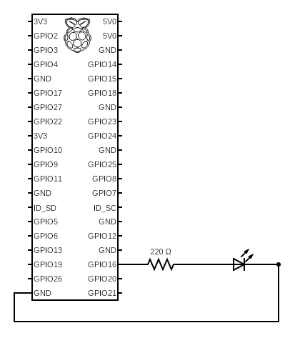
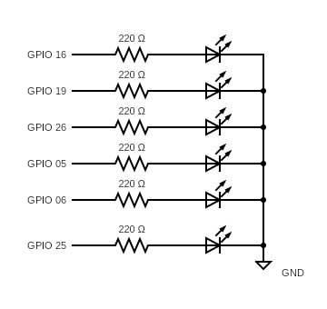

# Raspberry Pi Pigpio Demos with C-language

Welcome to the Raspberry Pi 4 Model B Pigpio Demos with C-language repository! This repository contains a series of practical examples and tutorials for programming GPIO pins on a Raspberry Pi using the Pigpio library.

## Table of Contents

- [Examples](#examples)
- [Getting Started](#getting-started)
- [Contributors](#contributors)

## Examples

### Example 01: LED Blink
**Filename:** 01_LEDblink.c

**Description:**
This example demonstrates how to control an LED connected to a GPIO pin on your Raspberry Pi. The program blinks the LED on and off in a loop until you press Ctrl+C to exit. It serves as a basic introduction to GPIO pin manipulation using Pigpio.

### Example 02: Traffic Light Simulation
**Filename:** 02_trafficlight.c

**Description:**
In this example, we simulate a traffic light using multiple LEDs connected to GPIO pins on your Raspberry Pi. The program cycles through the typical traffic light sequence: green light on for 3 seconds, followed by yellow light blinking for 3 seconds, and then the red light on for 3 seconds. The cycle repeats until you press Ctrl+C to exit. This example demonstrates more advanced GPIO pin control and sequencing using the Pigpio library.

### Example 03: LED Chase Light
**Filename:** 03_chaselight.c

**Description:**
In this example, we create a captivating LED chase light effect using an array of GPIO pins on your Raspberry Pi. The program cycles through the LEDs, turning them on and off sequentially to create a visually appealing chasing pattern. The chase light effect runs until you press Ctrl+C to exit. This example showcases advanced GPIO pin control for creating dynamic lighting patterns.

### Example 04: LED Button Control
**Filename: 04_LEDbuttonControl.c**

**Description:**
This example demonstrates how to control an LED using a push-button switch connected to a GPIO pin on your Raspberry Pi. When the button is pressed, it toggles the state of an LED (Red LED) between ON and OFF. The program also debounces the button input to ensure reliable operation.

### Example 05: LED Three-Button Control
**Filename: 05_LEDthreeButtonControl.c**

**Description:**
This example demonstrates how to control three LEDs using three push-button switches connected to GPIO pins on your Raspberry Pi. Each button toggles the state of its corresponding LED between ON and OFF. The program also debounces the button inputs to ensure reliable operation.

### Example 06: Buzzer Control
**Filename: 06_buzzer.c**

**Description:**
This example demonstrates how to control a buzzer connected to a GPIO pin on your Raspberry Pi. The program toggles the buzzer on and off with a 2-second delay in a loop. You can exit the program by pressing Ctrl+C. The code also handles GPIO cleanup.

### Example 07: 8-Segment Number Display
**Filename: 07_numberdisplay.c**

**Description:**
This example demonstrates how to control a 8-segment number display using GPIO pins on your Raspberry Pi. The program cycles through numbers 0-9 with a 1-second delay for each digit, displaying them on the 8-segment display. You can exit the program by pressing Ctrl+C. The code also handles GPIO cleanup.

## Getting Started

To get started with these demos, follow these steps:

1. Clone this repository to your Raspberry Pi.
2. Install the Pigpio library if you haven't already (see [Installing Pigpio](#installing-pigpio)).
3. Navigate to the demo file you want to run.
4. Compile and run the demo code as instructed in the demos's README or source code comments.

## Installing Pigpio

Before running the Pigpio projects, you need to install the Pigpio library on your Raspberry Pi. Follow these steps:

1. Open a terminal on your Raspberry Pi.

2. Update the package list:
sudo apt-get update

3. Install the Pigpio library:
sudo apt-get install pigpio

4. Start the Pigpio daemon:
sudo pigpiod

Feel free to explore the examples in this repository to learn more about working with GPIO pins and hardware control on your Raspberry Pi using the Pigpio library. Each example is accompanied by its own source code file and a description in this README.

## Contributors

- [Antti Buller](https://github.com/anatt1b)
  
- [Inosha Sugathapala](https://github.com/Inoshas)
 
- [Mari Kivioja](https://github.com/Veaiga)
 

